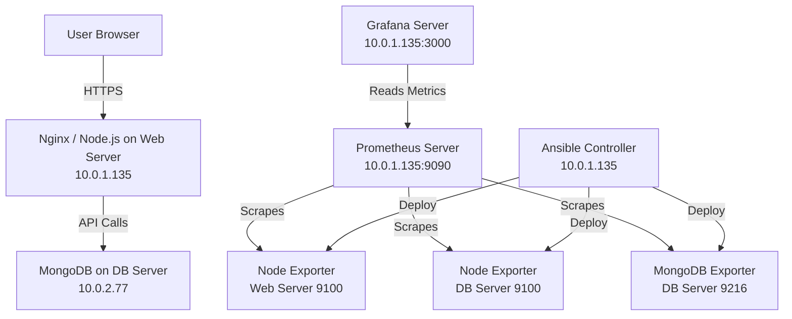

# MERN Application Deployment on AWS with IaC, Monitoring & Automation

##  Overview  
This project implements a **full MERN application deployment on AWS** using best DevOps practices:  
- **EC2 Web Server** hosting Node.js (backend) + MongoDB client  
- **EC2 DB Server** hosting MongoDB  
- **Prometheus + Grafana** for monitoring  
- **Node Exporter & MongoDB Exporter** for metrics  
- **Ansible** for automation  
- **PromQL Alerting Rules**  
- **Dashboards for Server & API Monitoring**

---

## ️ Architecture Diagram (Mermaid)


                ┌───────────────────────────┐
                │       User Browser        │
                └──────────────┬────────────┘
                               │ HTTP
                               ▼
      ┌───────────────────────────────────────────────────┐
      │               Web Server (10.0.1.135)             │
      │                                                   │
      │  ┌──────────────┐   ┌──────────────────────────┐  │
      │  │ Node.js API  │<--│    Prometheus :9090      │  │
      │  │ Backend      │   └──────────────────────────┘  │
      │  └──────────────┘             ▲                   │
      │         ▲                     │Scrapes            │
      │         │API Calls            │                   │
      │         ▼                     │                   │
      │  ┌──────────────┐   ┌──────────────────────────┐  │
      │  │ Mongo Client │   │     Grafana :3000        │  │
      │  └──────────────┘   └──────────────────────────┘  │
      │                                                   │
      │  ┌──────────────────────────┐                     │
      │  │ Node Exporter :9100      │<─── Ansible ─────── ┤
      │  └──────────────────────────┘                     │
      └───────────────────────────────────────────────────┘

                         │
                         │ MongoDB Query
                         ▼

      ┌───────────────────────────────────────────────────┐
      │                 DB Server (10.0.2.77)             │
      │                                                   │
      │  ┌──────────────┐                                 │
      │  │   MongoDB    │                                 │
      │  └──────────────┘                                 │
      │        ▲                                          │
      │        │                                          │
      │  ┌──────────────────────────┐                     │
      │  │ MongoDB Exporter :9216   │<─── Ansible ─────── ┤
      │  └──────────────────────────┘                     │
      │                                                   │
      │  ┌──────────────────────────┐                     │
      │  │ Node Exporter :9100      │<─── Ansible ─────── ┘
      │  └──────────────────────────┘                     
      └───────────────────────────────────────────────────┘


---

##  Repository Structure

```
ansible/
 ├── inventory.ini
 ├── playbook.yml
 ├── files/
 │    ├── node_exporter.tar.gz
 │    └── mongodb_exporter.tar.gz
 ├── tasks/
 │    ├── node_exporter.yml
 │    └── mongodb_exporter.yml
 └── templates/
backend/
 ├── index.js (Prometheus metrics enabled)
 ├── routes/
 ├── models/
 └── package.json
prometheus/
 ├── prometheus.yml
 └── rules/
      └── node_alerts.yml
grafana/
 ├── dashboards/
 │    ├── server_monitoring.json
 │    └── api_monitoring.json
README.md
```

---

##  Part A – Ansible Automation

### 1️⃣ Inventory File (`inventory.ini`)
```
[web]
10.0.1.135 ansible_user=ubuntu ansible_ssh_private_key_file=~/robinB11.pem

[db]
10.0.2.77 ansible_user=ubuntu ansible_ssh_private_key_file=~/robinB11.pem
```

### 2️⃣ Master Playbook (`playbook.yml`)
Runs exporter installation on both servers.

### 3️⃣ Node Exporter Role
Installs & configures node exporter on **web server**.

### 4️⃣ MongoDB Exporter Role
Installs & configures MongoDB exporter on **DB server**.

---

##  Part B – Prometheus Configuration

### `/etc/prometheus/prometheus.yml`
```yaml
global:
  scrape_interval: 5s

scrape_configs:
  - job_name: "prometheus"
    static_configs:
      - targets: ["localhost:9090"]

  - job_name: "web-server"
    static_configs:
      - targets: ["10.0.1.135:9100"]

  - job_name: "db-server"
    static_configs:
      - targets: ["10.0.2.77:9100"]

  - job_name: "mongodb"
    static_configs:
      - targets: ["10.0.2.77:9216"]

rule_files:
  - "rules/node_alerts.yml"
```

### Alerting Rules: `rules/node_alerts.yml`
Includes CPU, memory & node-down alerts.

---

##  Part C – Grafana Dashboards

### 1️ Server Monitoring Dashboard  
Metrics included:
- CPU Usage (PromQL)
- Memory Usage
- Disk I/O
- System Load
- Uptime
- Exporter status

### 2️ API Monitoring Dashboard  
Metrics included:
- API request count per route
- Latency (if implemented)
- Total requests
- Error rate
- MongoDB performance stats

---

## Part D – Backend Metrics (prom-client)

### Added in `index.js`
- `/metrics` endpoint  
- Counters for API calls  
- Default Node.js process metrics  

Test:
```
curl http://localhost:5000/metrics
```

---

##  Validation Steps

### 1. Prometheus Targets  
Visit:
```
http://<web-server-public-ip>:9090/targets
```
All exporters must show **UP**.

### 2. Grafana Dashboards  
Import JSON dashboards into Grafana:
```
http://<web-server-public-ip>:3000
```

### 3. API Metrics  
```
curl http://localhost:5000/api/test
```
Check counter increment:
```
curl http://localhost:5000/metrics | grep api_requests_total
```

---
